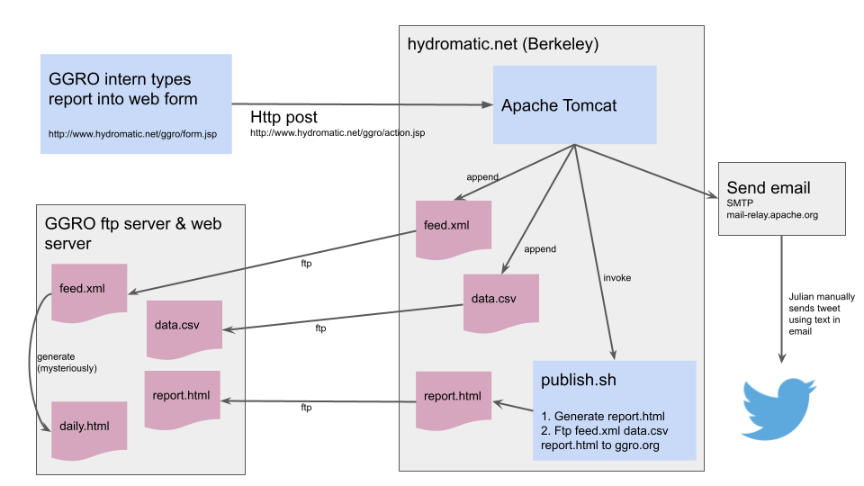

# ggro
An application to manage the
[Golden Gate Raptor Observatory](http://www.parksconservancy.org/programs/ggro)'s
raptor observation data.

A daily summary of the results is published as a
[web log](http://www.parksconservancy.org/conservation/plants-animals/raptors/research/daily-hawk-count.html)
and via [twitter (@ggro_raptors)](https://twitter.com/ggro_raptors).

## Data flow

The following diagram shows the flow of events from submitting an HTTP
form to generating an email, appending to the <code>data.csv</code>
file, generating the RSS feed, and publishing to the Parks Conservancy
web site.

